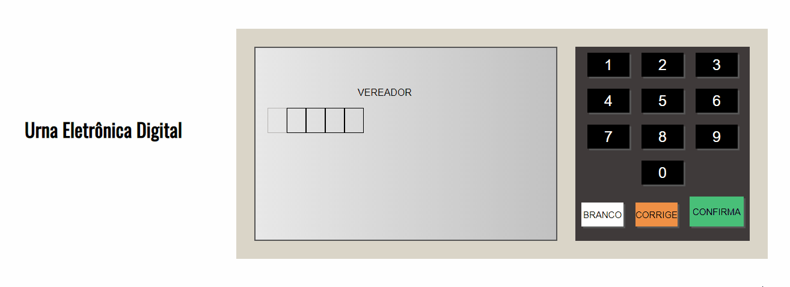

<h1 align="center"><strong>Urna Eletrônica Digital</strong></h1>

 

## 📕 About

Digital Electronic Urn is a clone of the Electronic Urn used in the Elections in Brazil. It is only intended to improve the front-end fundamentals. The file [etapas.js](https://github.com/EnzoAlexsander/urna-eletronica-digital/blob/main/etapas.js) contains all the options available to vote in the ballot box.
  

## 💻 Preview

    

  

## 🔨 Tools

- HTML
- CSS
- JavaScript
  

## 🙋🏽‍♂️ Author

### Enzo Alexsander